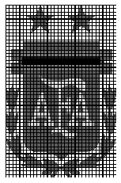

# Ejercitación de slices

Para ejercitar el uso de slices e indexación se trabajará realizando modificaciones sobre el siguiente logo de la AFA en escala de grises:

Esta actividad deberá resolverse utilizando  numpy y las funciones de matplotlib

* [imread](https://matplotlib.org/stable/api/_as_gen/matplotlib.pyplot.imread.html) para cargar la imagen
* [imshow](https://matplotlib.org/stable/api/_as_gen/matplotlib.pyplot.imshow.html) para levantar la imagen

**No deberán utlizar ningún tipo de loop (for / while)**

## Ejercicio 1: Cortar las letras dentro del logo

## Ejercicio 2: Cortar las estrellas y tranpsonerlas

## Ejercicio 3:  Generar una mascara separando el color de fondo del logotipo

## Ejercicio 4:  Cambiar el color de fondo de blanco a negro

## Ejercicio 5:  Espejar la imagen

## Ejercicio 6:  Dibujar una grilla (pista, usar strides)

