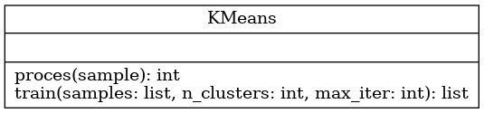

# TDD & K-Means

## Parte 1: Implementación K-Means utlizando TDD:

Implementar el algoritmo KMeans en una clase que respete la siguiente interfaz:

Utilizar tdd durante el desarrollo del algoritmo. Se sugire el siguiente proceso de desarrollo:

1) Implemente el algoritmo que funcione para muestras de 1 feature y 2 clases

2) Implemente el algorimto para 2 features y 2 clases

3) Implemente el algorimto para 2 features y 3 clases

4) Verifique que el algorimto funciona para N features y N clases

Nota: El algorimto utiliza un proceso de inicialización de centroides aleatorio que lo lleva converger a distintas soluciones. Agregue un modo de inicialización deterministico que le permita realizar testeos de unidad.

## Parte 2: Síntesis de muestras utilizando Autoencoders.

1) Mediante un autoencoder comprimir las imágenes de fashin-MINST

1) Utilice el algorimto K-Means para clusterizar las imágenes en el espacio comprimido.

2) A partir de la media y la covarianza en cada cluster genere distribuciones gausianas multivariadas.

3) Genere realizaciones de esas gausianas y descomprímalas mediante el Autoencodere y observe si imágenes sintetizadas tienen sentido.
